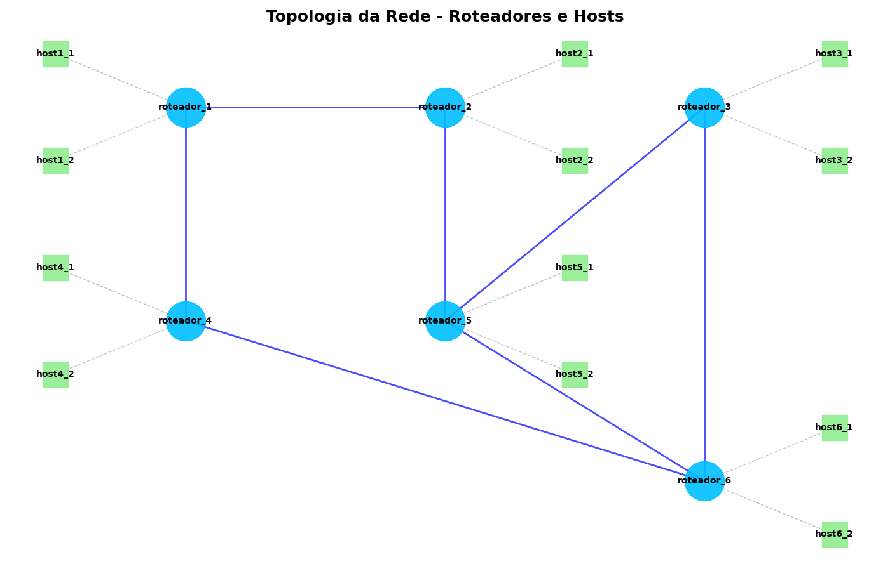

---

# 🧭 Projeto de Roteamento por Estado de Enlace com Docker e Python

Este projeto foi desenvolvido como parte da **Primeira Avaliação da disciplina Redes de Computadores II**, do curso de **Sistemas de Informação da Universidade Federal do Piauí (UFPI)**. O objetivo é simular uma rede de computadores com roteadores que implementam o **Algoritmo de Estado de Enlace (Link State Algorithm)** utilizando **Python** e **Docker**.

---

## 📌 Objetivos do Projeto

* Simular uma rede composta por múltiplas subredes (cada uma com 2 hosts e 1 roteador).
* Conectar roteadores entre si em uma **topologia parcialmente conectada** e aleatória.
* Implementar o **Algoritmo de Estado de Enlace** com manutenção de LSDB e cálculo de rotas com **Dijkstra**.
* Utilizar **Docker** para isolar os elementos da rede.
* Permitir **comunicação entre hosts** por meio de pacotes roteados dinamicamente.

---

## ⚙️ Tecnologias Utilizadas

* **Python** – Para implementar a lógica de roteamento e testes.
* **Docker** – Para criar e isolar hosts e roteadores em containers.
* **Docker Compose** – Para orquestrar a rede.
* **UDP** – Protocolo escolhido para troca de pacotes de estado de enlace.
* **Threads** – Gerenciamento simultâneo de envio e recebimento de pacotes.

---

## 📡 Justificativa da Escolha do Protocolo: UDP

O protocolo **UDP (User Datagram Protocol)** foi escolhido devido à sua simplicidade e rapidez na transmissão de pacotes. Como os pacotes de estado de enlace são enviados de forma periódica e frequente, **não há necessidade de confiabilidade garantida como no TCP**, sendo o UDP mais eficiente neste contexto.

---

## 🛠️ Estrutura do Projeto

```plaintext
REDES-AREE/
├── host/
│   ├── Dockerfile
│   ├── host.py
│   └── start.sh
├── router/
│   ├── config.py
│   ├── dijkstra.py
│   ├── Dockerfile
│   ├── log.py
│   ├── lsa.py
│   ├── main.py
│   ├── roteador.py
│   └── start.sh
├── Testes/
│   ├── conectividade/
│   │   ├── config.py
│   │   ├── docker_utils.py
│   │   ├── main.py
│   │   └── ping_test.py
│   ├── ping_teste/
│   │   ├── core/
│   │   │   ├── docker_utils.py
│   │   │   ├── utils.py
│   │   │   └── main.py
│   └── rede_roteadores/
│       ├── main.py
│       ├── roteadores.py
│       └── utilitarios.py
├── docker-compose.yml
├── README.md
└── topologia.png
```

---

## 🧠 Funcionamento Interno

### 🔄 Threads nos Roteadores

Cada roteador possui:

* Uma **thread de envio** de pacotes de estado de enlace para seus vizinhos.
* Uma **thread de recepção**, que atualiza a base LSDB e dispara o cálculo de novas rotas.

### 📦 Formato dos Pacotes LSA

```json
{
  "id": "roteador_1",
  "ip": "172.20.1.3",
  "vizinhos": {
    "roteador_4": ["172.20.4.3", 1],
    "roteador_2": ["172.20.2.3", 1]
  },
  "seq": 5
}
```

### 🧮 Algoritmo de Dijkstra

Implementado em `dijkstra.py`, calcula as rotas mais curtas com base nas informações acumuladas na LSDB.

---

## 🧱 Topologia da Rede

A topologia entre roteadores foi ,inicialmente,**gerada aleatoriamente**, garantindo que a rede esteja **parcialmente conectada**. Isso significa que cada roteador tem pelo menos um vizinho direto, o que assegura a conectividade global da rede.



---

## 🚀 Como Executar o Projeto

### ✅ Pré-requisitos

* Docker instalado e configurado.
* Docker Compose instalado.

### 📦 Passos

1. **Clone o repositório**:

   ```bash
   git clone https://github.com/CtrlHoney/Redes-AREE.git
   cd redes-aree
   ```

2. **Execute o Docker Compose**:

   ```bash
   docker-compose up --build
   ```

3. **Acompanhe os logs e testes de ping** nos containers dos hosts e roteadores.

4. **Encerrar o ambiente**:

   ```bash
   docker-compose down
   ```

---

## 🧪 Testes

A pasta `Testes/` está organizada para facilitar a verificação completa do funcionamento da rede.

### O que pode ser testado:

* **Testar o ping entre todos os hosts:**
  Verifique a conectividade entre todos os containers que representam hosts, garantindo que todos possam se comunicar entre si com sucesso.

* **Exibir a tabela de roteamento nos roteadores:**
  Consulte as tabelas de roteamento de cada roteador para validar as rotas configuradas e confirmar se as rotas estão corretamente estabelecidas.

* **Testar a conectividade entre os roteadores:**
  Realize testes de ping entre os roteadores para confirmar que a comunicação entre eles está ativa e funcional.

### Como os testes estão organizados:

* O script para testar a conectividade entre **hosts** realiza pings entre todos os hosts da rede.
* Na pasta `rede_roteadores/` há scripts que exibem as tabelas de roteamento dos roteadores.
* A pasta `conectividade/` contém scripts que testam a conectividade especificamente entre os roteadores da rede.

### O que observar nos resultados:

* Para os testes de ping, cada par de hosts/roteadores testados indicará sucesso ou falha, com o tempo de resposta.
* Nas tabelas de roteamento, verifique se as rotas apontam para os destinos corretos, sem conflitos ou rotas ausentes.

---

## 📊 Resultados Esperados

* Hosts devem conseguir se comunicar mesmo estando em subredes diferentes.
* Logs devem exibir o recebimento de pacotes LSA e atualização de rotas.
* As tabelas de roteamento são atualizadas dinamicamente.

---

## 👤 Autor

Desenvolvido por **Válber Carvalho** – UFPI | Sistemas de Informação – 2024

---
